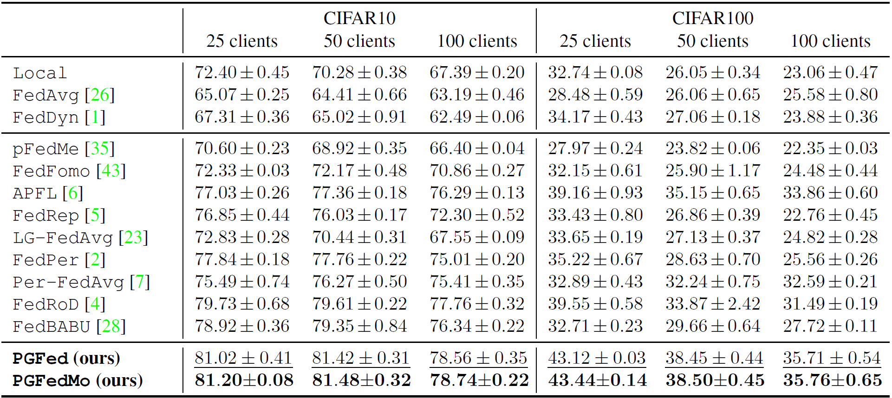
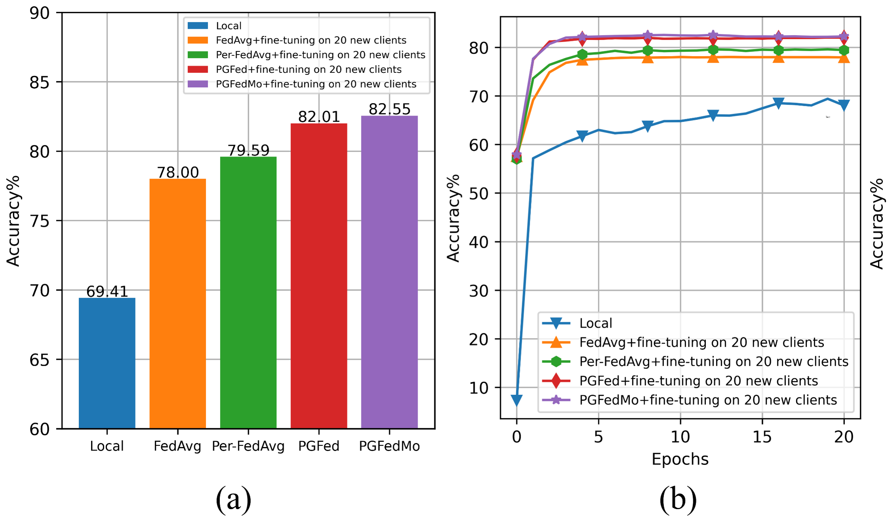

# PGFed: Personalize Each Client’s Global Objective for Federated Learning

This repository contains the code and experiemnts for the [ICCV 2023](https://iccv2023.thecvf.com/) paper: [PGFed: Personalize Each Client’s Global Objective for Federated Learning](https://arxiv.org/abs/2212.01448). This implementation is greatly inspired by [this repo](https://github.com/TsingZ0/PFL-Non-IID). Shout out to its contributors!

## Abstract

Personalized federated learning has received an upsurge of attention due to the mediocre performance of conventional federated learning (FL) over heterogeneous data. Unlike conventional FL which trains a single global consensus model, personalized FL allows different models for different clients. However, existing personalized FL algorithms only implicitly transfer the collaborative knowledge across the federation by embedding the knowledge into the aggregated model or regularization. We observed that this implicit knowledge transfer fails to maximize the potential of each client's empirical risk toward other clients. Based on our observation, in this work, we propose Personalized Global Federated Learning (PGFed), a novel personalized FL framework that enables each client to personalize its own global objective by explicitly and adaptively aggregating the empirical risks of itself and other clients. To avoid massive (O(N^2)) communication overhead and potential privacy leakage while achieving this, each client's risk is estimated through a first-order approximation for other clients' adaptive risk aggregation. On top of PGFed, we develop a momentum upgrade, dubbed PGFedMo, to more efficiently utilize clients' empirical risks. Our extensive experiments on four datasets under different federated settings show consistent improvements of PGFed over previous state-of-the-art methods.


## Requirements
This code can be successfully run in `Python 3.6.8` environment. To download the dependent packages for this implementation, in `Python 3.6.8` environment, run
```bash
pip install -r requirements.txt
```

## Generate federated datasets

Four datasets are used in our experiments: CIFAR10, CIFAR100, OrganAMNIST (from the [MedMNIST collection](https://arxiv.org/abs/2110.14795)), and [Office-home](https://www.hemanthdv.org/officeHomeDataset.html). The datasets are partitioned into different number of clients according to a Dirichlet distribution with the parameter $\alpha$ equals to 0.3 (by default) or 1.0. To generate the federated datasets, first change directory to `dataset/`:

```bash
cd ./dataset
```

### CIFAR10, CIFAR100, & OrganAMNIST
For CIFAR10, CIFAR100, and OrganAMNIST, to change the $\alpha$ for the Dirichlet distribution, change the value of variable `alpha` in [line 10](https://github.com/ljaiverson/pgfed/blob/762712859b810fc04a8a7fd31077994b3a31da84/dataset/utils/dataset_utils.py?plain=1#L10) of `./dataset/utils/dataset_utils.py`. To change the number of clients, change the value of the variable `num_clients` at the top of `./dataset/generate_cifar10.py`, `./dataset/generate_cifar100.py`, or `./dataset/generate_medmnist.py`. Then, to generate the federated dataset, run

```bash
python generate_cifar10.py noniid - dir
```

or

```bash
python generate_cifar100.py noniid - dir
```

or

```bash
python generate_medmnist.py noniid - dir
```

### Office-home
For Office-home dataset, first download and unzip the raw dataset from [its website](https://www.hemanthdv.org/officeHomeDataset.html) to `./dataset/`. Then rename the unzipped folder to `Office-home-raw/`, after which you should have the following structure.

```bash
├── dataset
│   ├── Office-home-raw
│   │   ├── Art/
│   │   ├── Clipart/
│   │   ├── Product/
│   │   ├── Real World/
│   │   ├── ImageInfo.csv/
│   │   ├── imagelist.txt/
│   ├── generate_cifar10.py
│   ├── generate_cifar100.py
│   ├── generate_medmnist.py
│   ├── generate_office_home.py
├── ...
```

To change the number of clients or the $\alpha$ of the Dirichlet distribution, change the value of the corresponding variable at the top of `./dataset/generate_office_home.py`. Then, to generate the federated dataset from Office-home, run

```bash
python generate_office_home.py
```


## Running experiments

To run the experiments, after finishing generating the dataset, change directory to `system/`


```bash
cd ../system/
```

Our expriments contains a total of 14 global or personalized federated learning algorithms with different federated settings such as the total number of clients, joining ratio (sample rate) for each round, total global rounds, local steps, etc. To have a full understanding of the options to run the code, run 

```bash
python main.py --help
```

An example of the commands to run each of the 14 algorithms are provided in `./system/traincifar10_25clt_example.sh`. Here, you will find how to run the algorithms with the previously processed federated CIFAR10 (25 clients). These example commands by default will run the training for 2 global rounds, and 2 local steps. The client sample rate is 25%. If a full experiment is intended (e.g. 150 rounds, 5 local steps), you can run

```bash
# FedAvg
python main.py -data cifar10 -nc 25 -jr 0.25 -gr 150 -ls 5 -algo FedAvg
```

for FedAvg, or

```bash
# PGFed
python main.py -data cifar10 -nc 25 -jr 0.25 -gr 2 -ls 2 -algo PGFed -mu 0.1 -lam 0.01 -bt 0.0
```

The results on CIFAR10 and CIFAR100 is shown below.

<p align="center">
  
</p>

for the proposed PGFed algorithm.

Note that, to run the experiments of fine-tuning the trained global models for some personalized federated learning altorithms, comment the normal training block ([line 106-110](https://github.com/ljaiverson/pgfed/blob/8499c9be19e840f0018280fbab4c9c599fed790a/system/main.py#L106-L110)) and uncomment the training and fine-tuning block ([line 114-126](https://github.com/ljaiverson/pgfed/blob/8499c9be19e840f0018280fbab4c9c599fed790a/system/main.py#L114-L126)). The result should be similar to the figures below.

<p align="center">
  
</p>

## Citation

If you find our code useful, please consider citing:

```
@article{luo2022pgfed,
  title={PGFed: Personalize Each Client's Global Objective for Federated Learning},
  author={Luo, Jun and Mendieta, Matias and Chen, Chen and Wu, Shandong},
  journal={arXiv preprint arXiv:2212.01448},
  year={2022}
}
```

